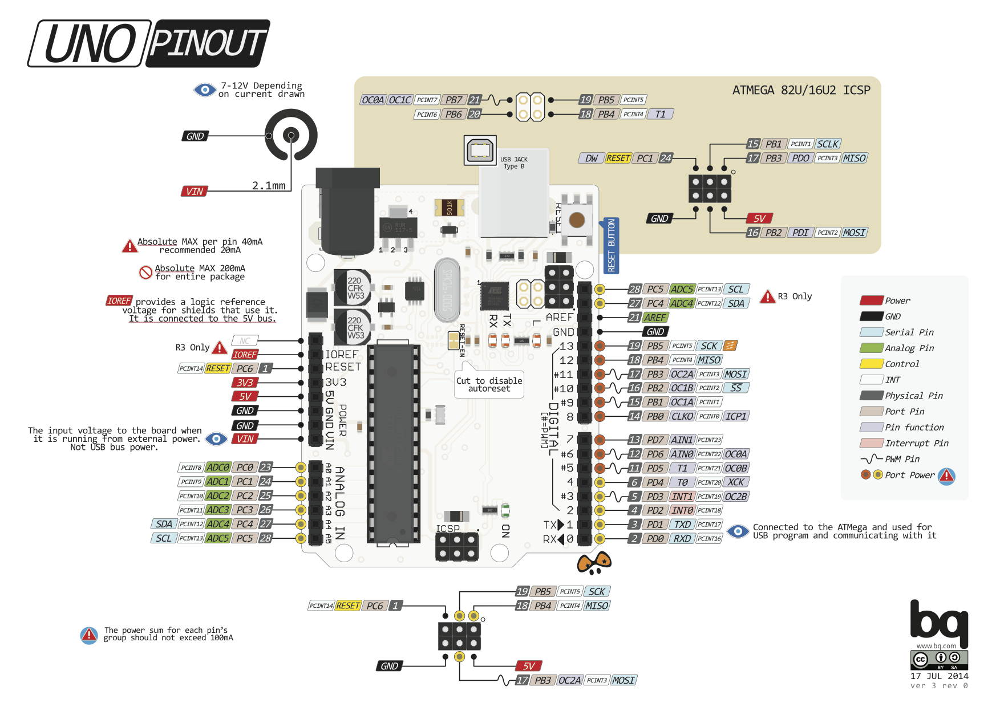
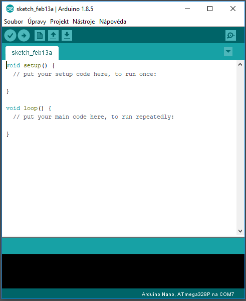
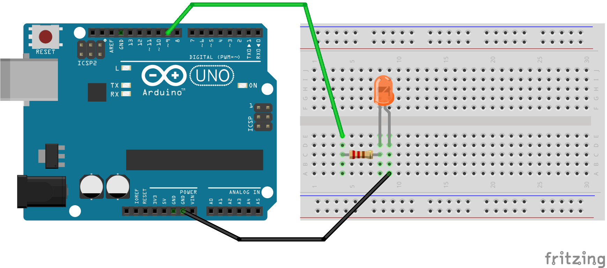
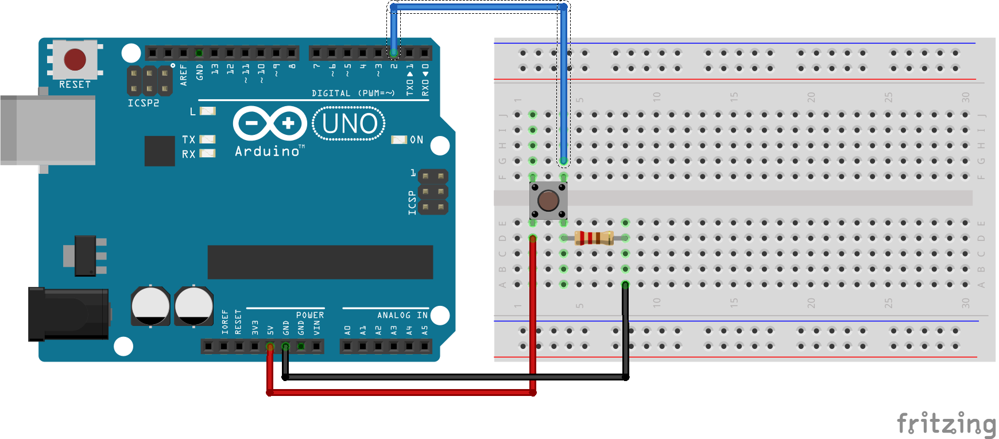
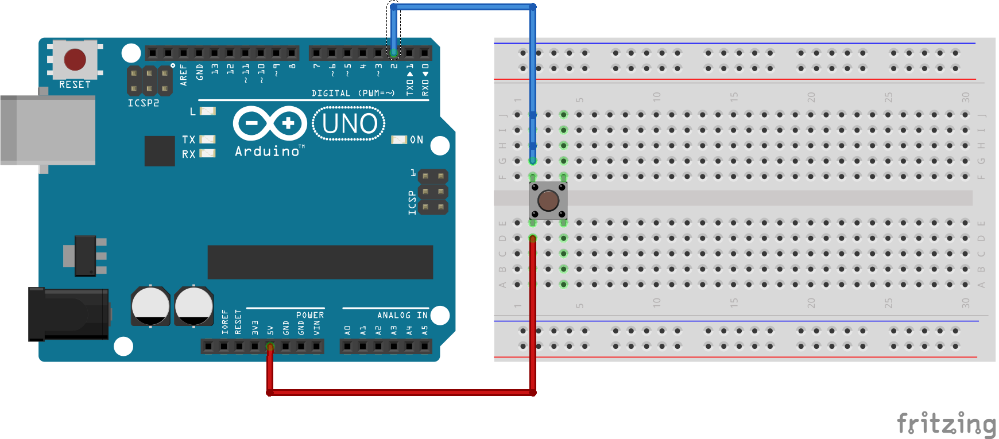
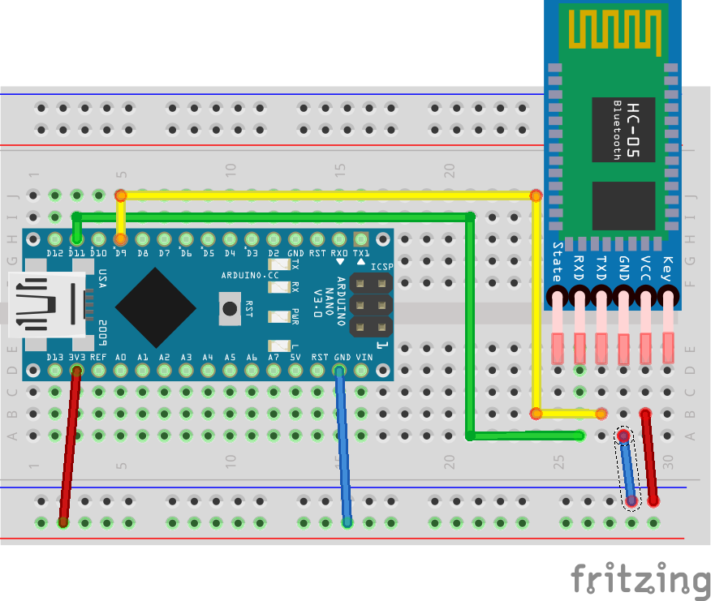
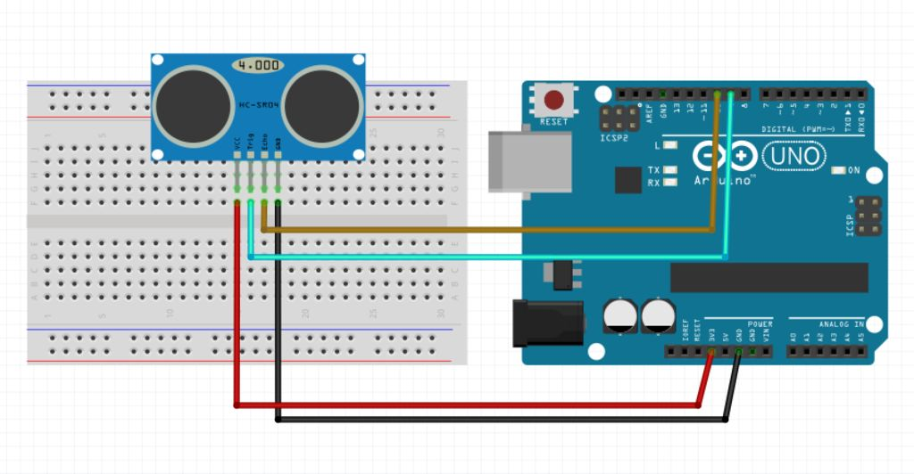

# Arduino 

## Úvod do Arduino světa
### Co je to arduino?

Wikipedie říká: 
> Arduino [čti Arduíno] je název malého jednodeskového počítače založeného na mikrokontrolerech ATmega od firmy Atmel. Svým návrhem se snaží podpořit výuku informatiky ve školách a seznámit studenty s tím, jak jsou pomocí počítačů řízena různá zařízení (např. mikrovlnná trouba, automatická pračka a jiné stroje). Nejedná se tedy o počítač ve smyslu stolního počítače nebo chytrého telefonu. Nelze proto k němu snadno přímo připojit monitor ani klávesnici či myš, ale je připraven na připojení LED diod, LCD displeje , servomotorů, senzorů, osvětlení atd.

- open source vývojová platforma původem z Itálie ([20 různých desek][5]), mnoho dalších variant a shieldů ([odkaz][6]) 
- postavená okolo procesoru ATMega
- programovací jazyk [Wiring][1] (takové C++)
- vývojové prostředí [Arduino][2] (jen trochu chytřejší textový editor), [Platformio][3] nebo programování ve [Visual Studiu][4]

[1]: https://arduino.cz/zakladni-struktury-jazyka-wiring/
[2]: https://www.arduino.cc/en/Main/Software
[3]: https://platformio.org/
[4]: https://marketplace.visualstudio.com/items?itemName=VisualMicro.ArduinoIDEforVisualStudio
[5]: https://www.arduino.cc/en/Products/Compare
[6]: http://playground.arduino.cc/Main/SimilarBoards

### Bližší pohled na desku
- V našem případě budeme používat desku Arduino UNO
- porty: 
    - 14 digitálních vstupů nebo výstupů (záleží na konkrétním nastavení) číslovaných 0 až 13
    - šest analogových vstupů (0–6)
    - různé vývody napájení (napájecí napětí, 5V stabilizovaných, 3.3V, GND)



### Programování 
#### Programovací prostředí (IDE)
Není tak komplikovaný jako "vyspělá" prostředí pro pokročilé jazyky. V hlavní časti okna nalezneme prostor pro náš kód, nad ním několik užitečných tlačítek pro zkontrolování kódu, nahrávání programu, uložení, atd. V řádků navigačních prvků nás bude zajímat nabídka Nástroje, kde musíme nastavit správnou desku a seriový port.

#### Struktura programu
Základní struktura programovacího jazyka Arduino je poměrně jednoduchá a skládá se nejméně ze dvou
částí, přesněji funkcí.

Funkce `setup()` by měla být volána až po deklaraci všech proměnných na začátku programu. Tato funkce se
používá například k nastavení pinů Arduina na vstup nebo výstup, nastavení parametrů sériové komunikace
a podobných jednorázových akcí.

Po funkci `setup()` následuje funkce `loop()`. Tělo této funkce obsahuje programový kód, který bude opakovaně
prováděn v nekonečné smyčce, například čtení vstupů, nastavování výstupů, výpočty, atd. Tato funkce je
jádrem všech programů Arduina a vykonává většinu činností. 

```cpp
int ledPin = 13; // pojmenování LED

void setup () {
 pinMode(ledPin, OUTPUT); // nastavení pinu do digitální výstup
}

void loop () {
 digitalWrite(ledPin, HIGH); // zapnutí LED
 delay (1000); // počkáme jednu sekundu (1000 milisekund)
 digitalWrite(ledPin, LOW); // vypnutí LED
 delay (1000); // počkáme jednu sekundu 
}
```

**podmínky**
```cpp
if (temp >= 22)
{
  //Vypnout topení
}
else if (temp >= 18 && temp < 22)
{
  //Nedělej nic
}
else
{
  //Zapnout topení
}
```
**cykly**

```cpp
for (int i=0; i <= 255; i++){
      print(i);
      delay(10);
   }
```
```cpp
var = 0;
while(var < 200){
  // do something repetitive 200 times
  var++;
}
```


Detailnější úvod do programování naleznete [ZDE](http://www.hobbyrobot.cz/wp-content/uploads/ArduinoPriruckaProgramatora.pdf)

## Příklady

### Blíkání LED a používání tlačítek
_logická úroveň, zpoždění, digitální výstup, LED diody, analog write_

```cpp
int ledPin = 13; // pojmenování LED

void setup () {
 pinMode(ledPin, OUTPUT); // nastavení pinu do digitální výstup
}

void loop () {
 digitalWrite(ledPin, HIGH); // zapnutí LED
 delay (1000); // počkáme jednu sekundu (1000 milisekund)
 digitalWrite(ledPin, LOW); // vypnutí LED
 delay (1000); // počkáme jednu sekundu 
}
```
#### Modifikace 0,5
Zpoždění bez příkazu `delay()`
 ```cpp
// constants won't change. Used here to set a pin number:
const int ledPin =  LED_BUILTIN;// the number of the LED pin

// Variables will change:
int ledState = LOW;             // ledState used to set the LED

// Generally, you should use "unsigned long" for variables that hold time
// The value will quickly become too large for an int to store
unsigned long previousMillis = 0;        // will store last time LED was updated

// constants won't change:
const long interval = 1000;           // interval at which to blink (milliseconds)

void setup() {
  // set the digital pin as output:
  pinMode(ledPin, OUTPUT);
}

void loop() {
  // here is where you'd put code that needs to be running all the time.

  // check to see if it's time to blink the LED; that is, if the difference
  // between the current time and last time you blinked the LED is bigger than
  // the interval at which you want to blink the LED.
  unsigned long currentMillis = millis();

  if (currentMillis - previousMillis >= interval) {
    // save the last time you blinked the LED
    previousMillis = currentMillis;

    // if the LED is off turn it on and vice-versa:
    if (ledState == LOW) {
      ledState = HIGH;
    } else {
      ledState = LOW;
    }

    // set the LED with the ledState of the variable:
    digitalWrite(ledPin, ledState);
  }
}
```
#### Modifikace 0,7
Zpoždění bez příkazu `delay()` a schvonání kódu do funkce
 ```cpp
unsigned long previousMillis = 0;      
int ledPin = 13;
int ledState = 0;

void setup() {
 // set the digital pin as output:
 pinMode(ledPin, OUTPUT);
}

void loop() { 
 if (waitMoment(1000)) {    
   if (ledState == LOW) {
     ledState = HIGH;
   } else {
     ledState = LOW;
   }
   // set the LED with the ledState of the variable:
   digitalWrite(ledPin, ledState);
 }
}

bool waitMoment(int interval) {
   unsigned long currentMillis = millis();
   if (currentMillis - previousMillis >= interval) {
       previousMillis = currentMillis;
       return true;
   }
   return false;    
}
```

#### Modifikace 1
připojíme LED přes nepájívé pole

rezistor 220 Ohm

#### Modifikace 2
Vytvoření blikačky

#### Modifikace 3 
Postupné zesilování a zeslabování ledky

- Analogový výstup `analogWrite(pin, value)` (0 - 255) 

```cpp
int ledPin = 9; // pojmenování LED
int value = 0;    // pocatecni rozsviceni
int step = 5;    // jak velký bude krok 

void setup () {
 pinMode(ledPin, OUTPUT); // nastavení pinu do digitální výstup
}

void loop () {
    analogWrite(ledPin, value);
 
    value = value + step;

    // zmenim smer kdyz jsem na konci
    if (value <= 0 || value >= 255) {
        step = step*-1;
    }
    delay(20);
}
```
#### Modifikace 4 
Připojení tlačítka

rezostor 10K Ohm

```cpp
// constants won't change. They're used here to set pin numbers:
const int buttonPin = 2;     // the number of the pushbutton pin
const int ledPin =  13;      // the number of the LED pin

// variables will change:
int buttonState = 0;         // variable for reading the pushbutton status

void setup() {
  // initialize the LED pin as an output:
  pinMode(ledPin, OUTPUT);
  // initialize the pushbutton pin as an input:
  pinMode(buttonPin, INPUT);
}

void loop() {
  // read the state of the pushbutton value:
  buttonState = digitalRead(buttonPin);

  // check if the pushbutton is pressed. If it is, the buttonState is HIGH:
  if (buttonState == HIGH) {
    // turn LED on:
    digitalWrite(ledPin, HIGH);
  } else {
    // turn LED off:
    digitalWrite(ledPin, LOW);
  }
}
```

varianta s připojením input-pullup rezistoru softwarově 

```cpp
void setup() {
  //start serial connection
  Serial.begin(9600);
  //configure pin 2 as an input and enable the internal pull-up resistor
  pinMode(2, INPUT_PULLUP);
  pinMode(13, OUTPUT);

}

void loop() {
  //read the pushbutton value into a variable
  int sensorVal = digitalRead(2);
  //print out the value of the pushbutton
  Serial.println(sensorVal);

  // Keep in mind the pull-up means the pushbutton's logic is inverted. It goes
  // HIGH when it's open, and LOW when it's pressed. Turn on pin 13 when the
  // button's pressed, and off when it's not:
  if (sensorVal == HIGH) {
    digitalWrite(13, LOW);
  } else {
    digitalWrite(13, HIGH);
  }
}
```
#### Modifikace 5
Detekce hran na tlačítku 
```cpp
// this constant won't change:
const int  buttonPin = 2;    // the pin that the pushbutton is attached to
const int ledPin = 13;       // the pin that the LED is attached to

// Variables will change:
int buttonState = 0;         // current state of the button
int lastButtonState = 0;     // previous state of the button
bool state = 0;

void setup() {
  // initialize the button pin as a input:
  pinMode(buttonPin, INPUT);
  // initialize the LED as an output:
  pinMode(ledPin, OUTPUT);  
}


void loop() {
  // read the pushbutton input pin:
  buttonState = digitalRead(buttonPin);

  // compare the buttonState to its previous state
  if (buttonState != lastButtonState) {
    
    if (buttonState == HIGH) {
      state = true;
    } else {
      state = false;
    }
    // Delay a little bit to avoid bouncing
    delay(50);
  }
  // save the current state as the last state, for next time through the loop
  lastButtonState = buttonState;
  
  digitalWrite(ledPin, state);  
}
```

### Seriová komunikace
Slouží pro komunikaci s PC, případně Bluetooth. 
```cpp
void setup() {                
// Turn the Serial Protocol 
  Serial.begin(9600);
}
```
otevření seriové komunikace
```cpp
void setup() {                
// Turn the Serial Protocol 
  Serial.begin(9600);
  while (!Serial) {
    ; // wait for serial port to connect. Needed for native USB port only
    }
}
```
Posílání dat přes seriovou linku probíha pomocí příkazů `Serial.print()` a `Serial.println()`, 
čtení dat pomocí `Serial.available()` a `Serial.read()`.

Příklad:
```cpp
void setup() {                
// Turn the Serial Protocol 
  Serial.begin(9600);
  while (!Serial) {
    ; // wait for serial port to connect. Needed for native USB port only
    }
}
void loop(){
    Serial.print("Máma mele maso");
    delay(500);
    
    while (Serial.available()>0){
        serIn = Serial.read();	//read Serial        
        Serial.print(serIn, BYTE); 	//prints the character just read
     }
}
```

### Bluetooth modul HC-05

- [ZDROJ](http://navody.arduino-shop.cz/navody-k-produktum/arduino-bluetooth-modul-hc-05.html)
- Bluetooth ve verzi 2.0 
- s Arduinem komunikuje pomocí seriové linky
- dosah maximálně 10 metrů
- využíva kmihovnu `SoftwareSerial.h`



### Parkovací senzor (HC-SR04 + pípák)
- budeme potřebovat ultrazvukový senzor HC-SR04 a pípák (repráček)
- čerpáme opět z webu, přesněji [ZDE](http://www.instructables.com/id/HC-SR04-Buzzer-Arduino-Parking-Assist-Sensor/)



zapojení bzučáku je velmi jednoduché. Plus přivedeme na pin 6 a mínus na pin GND

kód:
```cpp
// defines pins numbers
const int trigPin = 9;
const int echoPin = 10;
const int buzzer = 3;
const int ledPin = 13;
// defines variables
long duration;
int distance;
int safetyDistance;

void setup() {
  pinMode(trigPin, OUTPUT); // Sets the trigPin as an Output
  pinMode(echoPin, INPUT); // Sets the echoPin as an Input
  pinMode(buzzer, OUTPUT); // Sets the buzzer as an Output
  pinMode(ledPin, OUTPUT); // Sets the ledPin as an Output
  
  safetyDistance = ultrasonic(); // init safety distance

  Serial.begin(9600);   // Starts the serial communication
}


void loop() {
  int dist = ultrasonic();

  if (dist <= 5) {  //distance for npnstop beep
    tone(buzzer, 500);  
    digitalWrite(ledPin, HIGH);
  }
  else if (dist <= safetyDistance) {
    int val = map(dist, 5,safetyDistance,100,800); //map delay depend on distance

    digitalWrite(ledPin, LOW);
    noTone(buzzer);  
    digitalWrite(ledPin, HIGH);
    tone(buzzer, 500);
    delay(val);
    digitalWrite(ledPin, LOW);
    noTone(buzzer);  
    delay(val);    
  }
  else{
    noTone (buzzer);
    digitalWrite(ledPin, LOW);
  }
}

int ultrasonic(){
  // Clears the trigPin
  digitalWrite(trigPin, LOW);
  delayMicroseconds(2);

  // Sets the trigPin on HIGH state for 10 micro seconds
  digitalWrite(trigPin, HIGH);
  delayMicroseconds(10);
  digitalWrite(trigPin, LOW);

  // Reads the echoPin, returns the sound wave travel time in microseconds
  duration = pulseIn(echoPin, HIGH);

  // Calculating the distance
  distance= duration*0.034/2;

  return distance;
}
```

### Jednoduchý termostat
- připojení teploměru a práce s relátkem
- asi by to chtělo zmínit pojmy spojitá a nespojitá regulace ( analogovy výstup / digitální)

kód:
```cpp
    
// připojení knihovny U8glib pro display
#include "U8glib.h"
// připojení knihovny pro DHT
#include <SimpleDHT.h>

// inicializace OLED displeje 
U8GLIB_SSD1306_128X64 mujOled(U8G_I2C_OPT_NONE);
// inicializace teplomeru
SimpleDHT11 dht11;

//pin na který muze byt připojena led, rele, ...
int outputPin = 8;

//promena pro displej.. nevim co dela
long int prepis = 0;

//pin na kterém je připojen DHT
int pinDHT11 = 2;

//promene pro ulozeni casu a vlhkosti
byte temperature = 0;
byte humidity = 0;

void setup(void) {
  pinMode(outputPin, OUTPUT); 
}

void loop(void) {
  dht11.read(pinDHT11, &temperature, &humidity, NULL);

  if (millis()-prepis > 100) {
    // následující skupina příkazů
    // obnoví obsah OLED displeje
    mujOled.firstPage();
    do {
      // funkce vykresli vykreslí žádanou obsah
      vykresli();
    } while( mujOled.nextPage() );
    // uložení posledního času obnovení
    prepis = millis();
  }

  if((int)temperature > 23){
    
    digitalWrite(outputPin,HIGH);   
  }
  else{
    digitalWrite(outputPin,LOW);
  }
  delay(500);
}

// funkce vykresli pro nastavení výpisu informací na OLED
void vykresli(void) {
  
  mujOled.setFont(u8g_font_unifont);
  
  mujOled.setPrintPos(0, 10);
  mujOled.print("Teplota: ");
  mujOled.print((int)temperature);
  
  mujOled.setPrintPos(0, 25);
  mujOled.print("Vlhkost: ");
  mujOled.print((int)humidity);
}
```

### Servo 
- V tomto příkladě si zapojíme servo a budeme ovladat úhel jeho natočení pomocí potenciometru
- [ZDROJ](https://www.arduino.cc/en/Tutorial/Knob)
kód:
```cpp
#include <Servo.h>

Servo myservo;  // create servo object to control a servo

int potpin = 0;  // analog pin used to connect the potentiometer
int val;    // variable to read the value from the analog pin

void setup() {
  myservo.attach(9);  // attaches the servo on pin 9 to the servo object
}

void loop() {
  val = analogRead(potpin);            // reads the value of the potentiometer (value between 0 and 1023)
  val = map(val, 0, 1023, 0, 180);     // scale it to use it with the servo (value between 0 and 180)
  myservo.write(val);                  // sets the servo position according to the scaled value
  delay(15);                           // waits for the servo to get there
}
```
### Ovládání relé pomocí IR 

- [Kouknout sem](http://www.instructables.com/id/Arduino-Infrared-Remote-tutorial/)


### Co dál? 
  - ukázat zakladni měřící přístroje 
  - vymyslet co delat... 
  - !!! komunikace s bluetooth

### Koho sledovat
  - [GreatScott](https://www.youtube.com/user/greatscottlab)
  - [educ8s.tv](https://www.youtube.com/user/educ8s)
  - [Arduino návody](https://www.youtube.com/channel/UCdU8_paowYi0kYOkjDHSrYg/videos)
### Dream nakupní košík 
  - 

## Základní práce s měřicími přístroji
[k pročtení](https://student.sps-prosek.cz/~klaumi11m/P%C5%99%C3%ADru%C4%8Dka%20-%20Z%C3%A1klady%20elektrick%C3%A9ho%20m%C4%9B%C5%99en%C3%AD.pdf)

### Multimetr

#### Napětí 
#### Proud
#### Odpor

### Osciloskop
  
  
## Zdroje:

[ARDUINO – příručka programátora ](http://robotikabrno.cz/docs/arduino/Pr%C5%AFvodce-sv%C4%9Btem-Arduina-CZ.pdf)

[Průvodce světem Arduina](http://robotikabrno.cz/docs/arduino/Pr%C5%AFvodce-sv%C4%9Btem-Arduina-CZ.pdf)

[Arduino: jak pro něj začít programovat](https://www.root.cz/clanky/arduino-jak-pro-nej-zacit-programovat)

[itnetwork.cz](https://www.itnetwork.cz/hardware-pc/arduino)

[Wikipedia](https://cs.wikipedia.org/wiki/Arduino)
